# The Cricket Quiz

* The Cricket Quiz is a site that targets people that want to take a quiz of their Cricket knowledge.It is 

designed to be fun and simple.

* The site is live [here]( https://amnasaqib.github.io/The-Cricket-Quiz/).

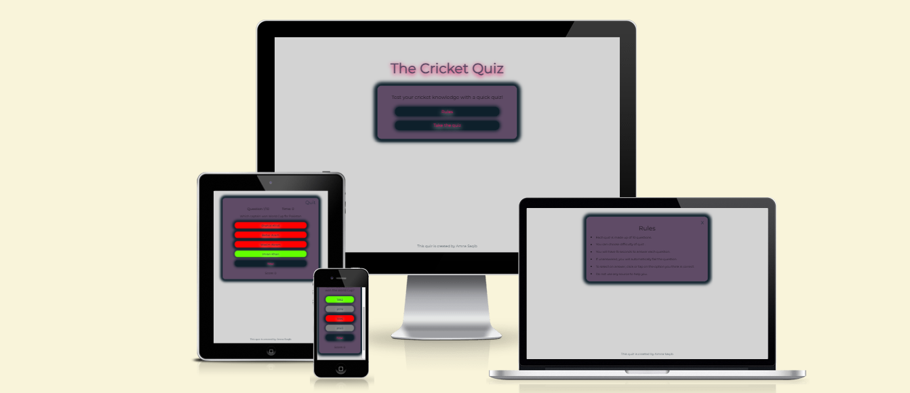

 ## Contents

  [User Experience](#user-experience)
  
 [The Cricket Quiz](#the-cricket-quiz)
- [The Cricket Quiz](#the-cricket-quiz)
  - [Contents](#contents)
  - [User Experience](#user-experience)
    - [User Stories](#user-stories)
  - [Site Structure](#site-structure)
  - [Design Choices](#design-choices)
    - [Font](#font)
    - [Color Palette](#color-palette)
  - [Features](#features)
    - [Existing Features](#existing-features)
  - [Technologies used](#technologies-used)
  - [Testing](#testing)
  - [Additional testing](#additional-testing)
  - [Deployment and Development](#deployment-and-development)
    - [Deploying the Site](#deploying-the-site)
  - [Credits](#credits)
    - [Content](#content)
  - [Acknowledgements](#acknowledgements)

 ## User Experience

### User Stories
* As a user i want to:

* test cricket knowledge with a quiz.
* be able to understand how to start the quiz.
* be able the select the difficulty level of my quiz.
* know the current score.
* know whether my answer is correct or incorrect.
* know my final score.

  ## Site Structure

* The site is made up of a single page that displays the main menu and heading upon loading. It then displays and hides different content depending on the actions of the user. More information on the different site features can be found in the [features](#features) section.

  ## Design Choices

  ### Font
* The fonts used throught the site are "Montserrat" and "sans-serif".

### Color Palette

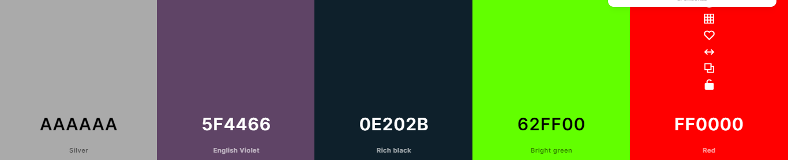
 
 * The color palette was choosen with the help of [coolers]((<https://coolors.co/>)) and i mixed two different color palettes according to my personal preference.

 [Back on top](#contents)

## Features

* The cricket quiz is designed to be an easy-to-use and interactive site with features that work on different devices.

 ### Existing Features 

* #### Heading 

  * The heading is featured on the landing page above the main menu.
  * It is styled to be captivating and its contents refer to the purpose of the site.
  * This helps users to understand what the site is about and creates a positive first impression.

[Back to top](#contents)

* #### Main Menu 

  * On the landing page is the main menu situated directly under the heading.
  * This contains text to entice the user to take part in a quiz as well as buttons to view the quiz rules or initiate a quiz.

    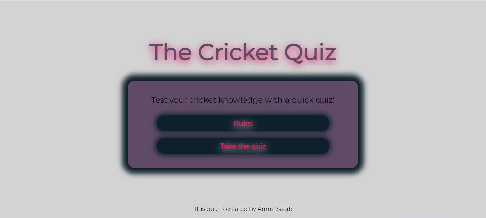

    [Back to top](#contents)

* #### Rules Modal
  * The rules modal is accessed through the "rules" button in the main menu.
  * It contains a list of rules for the quiz.
  * At the top right corner of the modal is a button to exit the rules modal and return to the main menu.
  * This is useful to users to learn how the quiz works and what the rules are when taking part.

    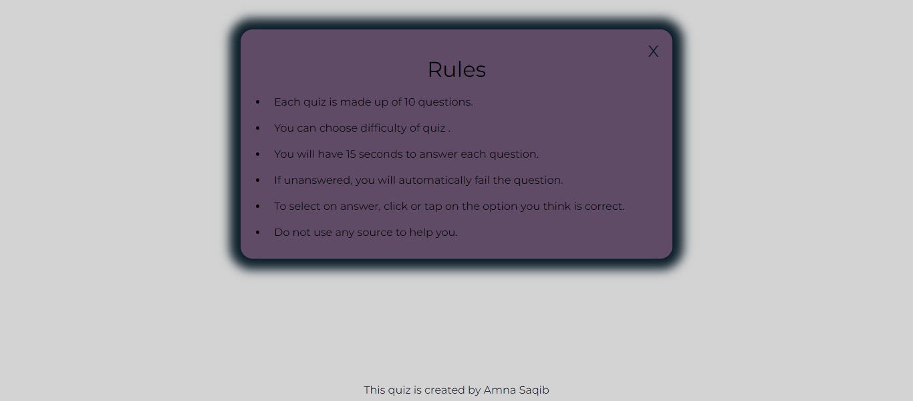

    [Back to top](#contents)

 *  #### Difficulty Menu
    * The difficulty menu is accessed through the "take the quiz" button in the main menu.
    * It contains buttons to select the difficulty levels.
    * It has two levels ; Easy and Hard.
    * Once one of the option buttons is clicked, the quiz associated with the selected difficulty begins.
    * At the top right corner of the modal is a button to exit the difficulty menu and return to the main menu.
    * This is useful for users to be able to choose the difficulty level of the quiz before they begin.
  
     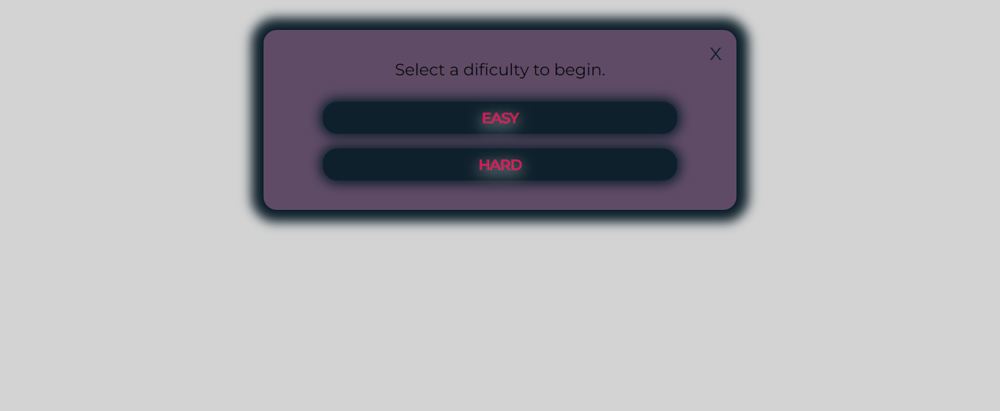

     [Back to top](#contents)

 * #### The Quiz Area

    * Once the user has selected a difficulty option, the quiz area is displayed and the quiz begins.
    *  It has a score at the bottom.
    *  It has timer running.
    *  The quiz has question number.
    *  It has a quit button at top right corner    
    *  
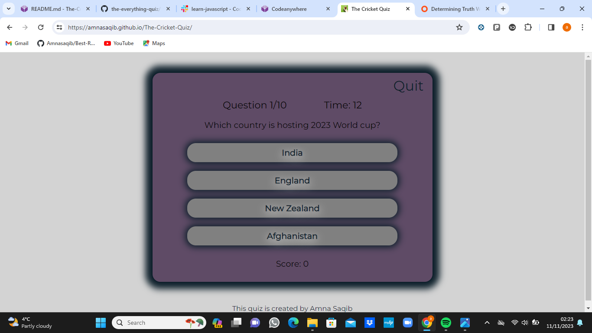

[Back to top](#contents)

* #### Footer
  * The bottom of site tell the name of creator of quiz.
  
  ## Technologies used
  
* [HTML5](https://html.spec.whatwg.org/)
  * Used to add structure and content to the site.

* [CSS](https://www.w3.org/Style/CSS/Overview.en.html)
  * Used to add style to the HTML.

* [JavaScript](https://www.javascript.com/)
  * Used to enhance functionality and interactivity throughout the site.

* [CodeAnyWhere](https://app.codeanywhere.com/)
  * Used to create the code for repository.
 
* [Github](https://github.com/)
  * Used to store the repository and deploy the site.

[Back to top](#contents)

## Testing 

* This site is tested and Validated by:

* # W3C HTML Validator 
  
  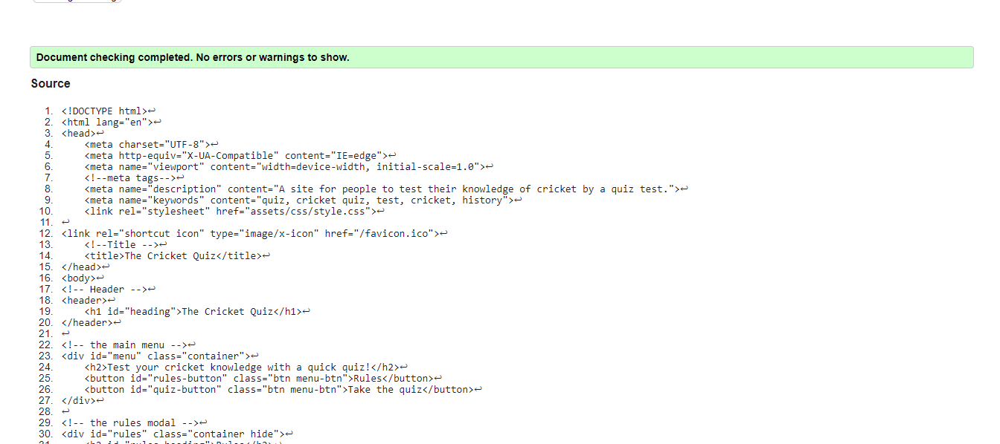
  
  * This site has 0 error.

* # CSS Validator
  
  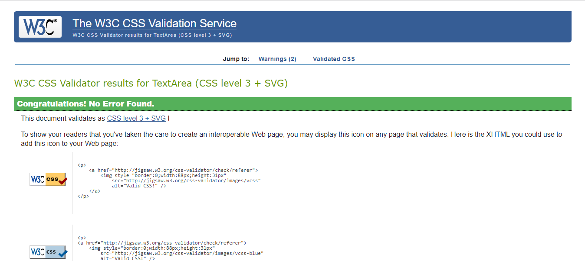
  
* # JS Hint 
   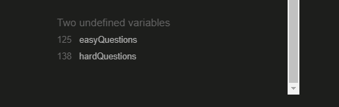

   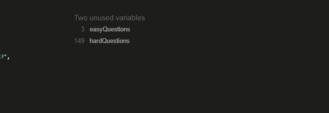

## Additional testing

* # Lighthouse

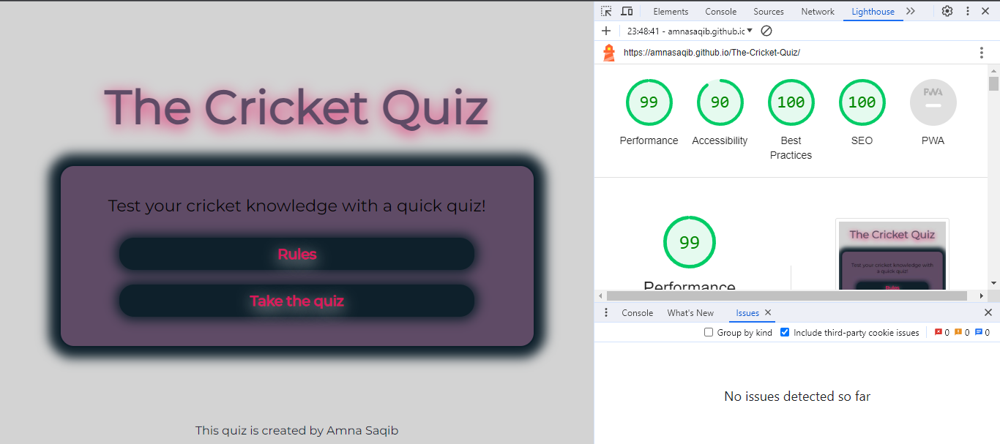

* # Wave Evaluation Tool

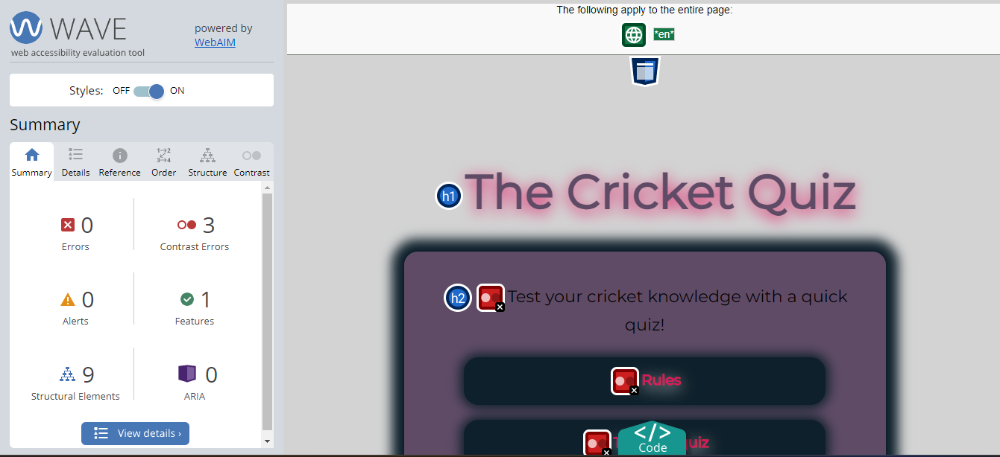

[Back to top](#contents)

## Deployment and Development

### Deploying the Site

* The site was deployed using GitHub pages through the following steps:
1. In the "The-Cricket-Quiz" GitHub repository, click on "settings".
2. Scroll down and click on the "pages" tab.
3. In the dropdown menu for the branch, select "main".
4. Click on "save".
5. Refresh the page to view the deployed website link.

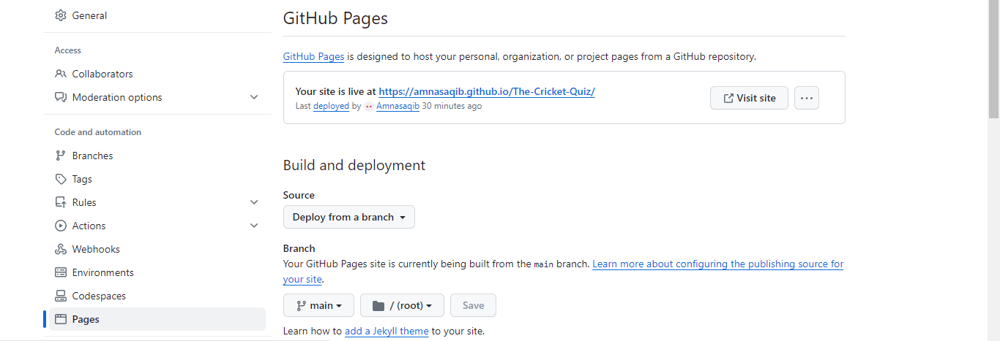

[Back to top](#contents)

## Credits

### Content
* The font used was taken from [Google Fonts](https://fonts.google.com/).
* The color palette was generated using [coolers](https://coolors.co/).
* The favicon was generated using this [favicon generator](https://www.favicongenerator.com/).

## Acknowledgements

This site was developed as a portfolio project for the [Code Institute](https://codeinstitute.net/global/).

Amna Saqib 2023